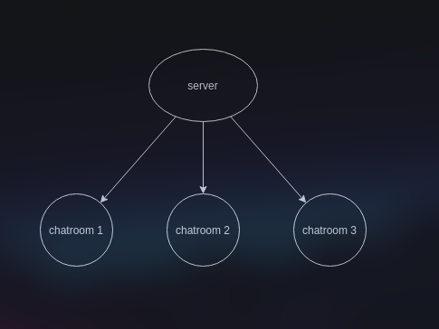
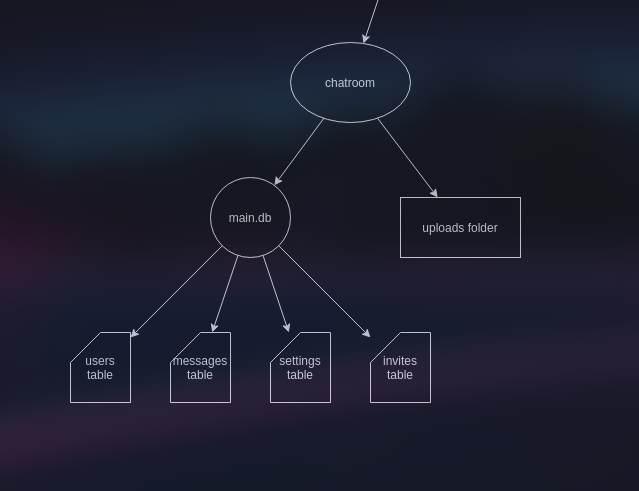

This is a long read, you may need some tea!  :)

# overview
An overview of how the server operates.

### server structure
Each server is responsible for handling multiple chatrooms. 

The server manages each chatroom individually. It doesnt store any centralized data but lets each chatroom manage their own database with their own users, channels, settings, etc. In effect each chatroom is its own segregated server-like system.

### chatroom structure

